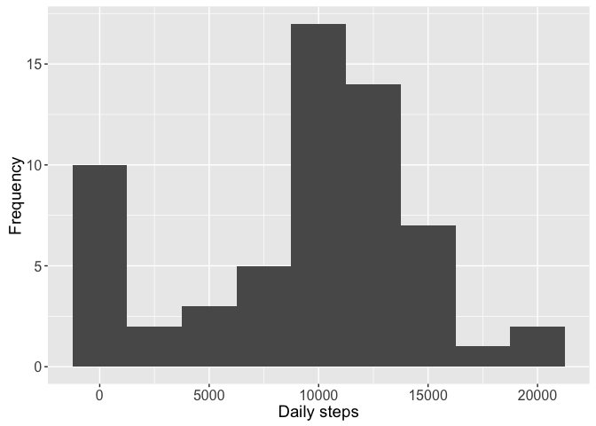
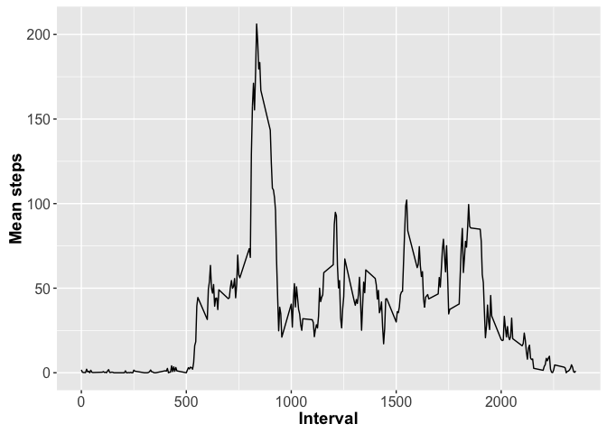
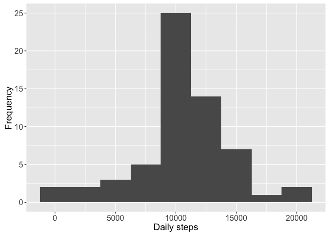
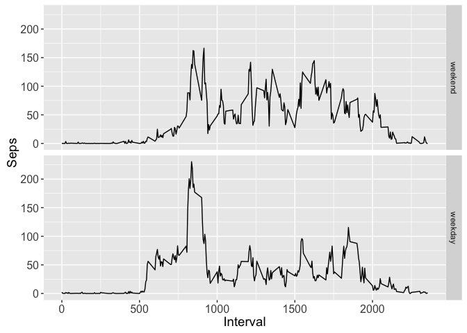

# Reproducible Research: Peer Assessment 1

## Loading and preprocessing the data

### Read data

```r
data <- read.csv ("activity.csv", header = T, sep = ",", stringsAsFactors = F)
```

### Convert date to the required format

```r
data$date <- as.Date(data$date, "%Y-%m-%d")
str(data)
```

```
## 'data.frame':	17568 obs. of  3 variables:
##  $ steps   : int  NA NA NA NA NA NA NA NA NA NA ...
##  $ date    : Date, format: "2012-10-01" "2012-10-01" ...
##  $ interval: int  0 5 10 15 20 25 30 35 40 45 ...
```

Display dimension and a few rows of the created dataframe


```r
dim(data)
```

```
## [1] 17568     3
```


```r
head(data)
```

```
##   steps       date interval
## 1    NA 2012-10-01        0
## 2    NA 2012-10-01        5
## 3    NA 2012-10-01       10
## 4    NA 2012-10-01       15
## 5    NA 2012-10-01       20
## 6    NA 2012-10-01       25
```

## What is mean total number of steps taken per day?
We can use dplyr to group and summarize the data into dailyAverage
Calculate the total number of steps per day and the mean number of daily steps:


```r
library (dplyr)
```

```
## 
## Attaching package: 'dplyr'
```

```
## The following objects are masked from 'package:stats':
## 
##     filter, lag
```

```
## The following objects are masked from 'package:base':
## 
##     intersect, setdiff, setequal, union
```

```r
dailyAverage <- data %>% group_by(date) %>% summarize(total.steps = sum(steps, na.rm = T), 
             mean.steps = mean(steps, na.rm = T))
```

### Display histogram of total steps


```r
library(ggplot2)
g <- ggplot(dailyAverage, aes(x=total.steps))
g + geom_histogram(binwidth = 2500) + theme(axis.text = element_text(size = 12),  
      axis.title = element_text(size = 14)) + labs(y = "Frequency") + labs(x = "Daily steps")
```

<!-- -->

The largest count around the 11000 steps, therefore the median is around 10000-12000. There is one outlier to the right. Otherwise the data is more or less symmetrically distributed.

### Show data summary


```r
summary(dailyAverage$total.steps)
```

```
##    Min. 1st Qu.  Median    Mean 3rd Qu.    Max. 
##       0    6778   10400    9354   12810   21190
```

### Show means summary

```r
summary (dailyAverage$mean.steps)
```

```
##    Min. 1st Qu.  Median    Mean 3rd Qu.    Max.    NA's 
##  0.1424 30.7000 37.3800 37.3800 46.1600 73.5900       8
```

## What is the average daily activity pattern?

Make a time series plot. If each interval is 5 minutes, then we calculate the min/max activity levels. The mean of each interval is:


```r
meanInterval <- data %>% group_by(interval) %>% summarize(mean.steps = mean(steps, na.rm = T))
g <- ggplot(meanInterval, aes(x = interval, y = mean.steps))
g + geom_line() + theme(axis.text = element_text(size = 12), axis.title = element_text(size = 14, face = "bold")) + 
labs(y = "Mean steps") + labs(x = "Interval")
```

<!-- -->

## Imputing missing values
Calculate the percentage of missing data (if any).
Calculate the number of NA rows.


```r
mean(is.na(data$steps))
```

```
## [1] 0.1311475
```


```r
sum(is.na(data$steps))
```

```
## [1] 2304
```

### Calculate missing values within meanInterval:


```r
sum(is.na(meanInterval$mean.steps))
```

```
## [1] 0
```

No missing values!

### Duplicate of the original data into data2 so we do not loose the original data when we add missing values:


```r
data2 <- data
```

Loop through the rows of data2 and fill in missing values with values pulled using interval as key:


```r
for (i in 1:nrow(data2)) {
      if (is.na(data2$steps[i])) {
            key <- data2$interval[i]
            val <- subset(meanInterval, interval==key)
            data2$steps[i] <- val$mean.steps
      }
}
head(data2)
```

```
##       steps       date interval
## 1 1.7169811 2012-10-01        0
## 2 0.3396226 2012-10-01        5
## 3 0.1320755 2012-10-01       10
## 4 0.1509434 2012-10-01       15
## 5 0.0754717 2012-10-01       20
## 6 2.0943396 2012-10-01       25
```

### Group data2 by date and calculate totals per day:


```r
mean2 <- data2 %>% group_by(date) %>% summarize(total.steps = sum(steps, na.rm = T))
```

And we can construct the histogram:


```r
g <- ggplot(mean2, aes(x=total.steps))
g + geom_histogram(binwidth = 2500) + theme(axis.text = element_text(size = 12),
      axis.title = element_text(size = 14)) + labs(y = "Frequency") + labs(x = "Daily steps")
```

<!-- -->

### Qualitative observations:

As with the original data, the largest count around the 11000 steps, therefore the median is around 10000-12000. There are no outliers and the data is more or less symmetrically distributed.

### Quantitative observations:


```r
summary (dailyAverage$total.steps)
```

```
##    Min. 1st Qu.  Median    Mean 3rd Qu.    Max. 
##       0    6778   10400    9354   12810   21190
```

```r
sd(dailyAverage$total.steps, na.rm=T)
```

```
## [1] 5405.895
```

```r
summary (mean2$total.steps)
```

```
##    Min. 1st Qu.  Median    Mean 3rd Qu.    Max. 
##      41    9819   10770   10770   12810   21190
```

```r
sd(mean2$total.steps, na.rm=T)
```

```
## [1] 3974.391
```

The data2 set seems to be less spread out, corroborated by the smaller standard deviation.

## Are there differences in activity patterns between weekdays and weekends?

### Isolate the weekend and weekday values and store in separate variables:


```r
data2$day <- ifelse(weekdays(data2$date) %in% c("Saturday", "Sunday"), "weekend", "weekday")
```


```r
weekend <- filter(data2, day == "weekend")
workday <- filter(data2, day == "weekday")
```

### Group by the intervals and calculate the mean number of steps for each time interval. 


```r
weekend <- weekend %>% group_by(interval) %>% summarize(mean.steps = mean(steps)) 
weekend$day <- "weekend"

workday <- workday %>% group_by(interval) %>% summarize(mean.steps = mean(steps)) 
workday$day <- "weekday"
```

### Combine the data sets into one named interval2


```r
interval2 <- rbind(weekend, workday)
interval2$day <- as.factor(interval2$day)
interval2$day <- relevel(interval2$day, "weekend")
```

### Display a two panel plot.


```r
g <- ggplot (interval2, aes (interval, mean.steps))
g + geom_line() + facet_grid (day~.) + theme(axis.text = element_text(size = 12), 
      axis.title = element_text(size = 14)) + labs(y = "Seps") + labs(x = "Interval")
```

<!-- -->

### Conclusion

There is a difference between weekdays and weekends:
* Weekdays:There is a noticeable increase in activities in the 7-9 interval. 
* Weekend: The activity levels are more uniform, over 100 steps, during most intervals.
